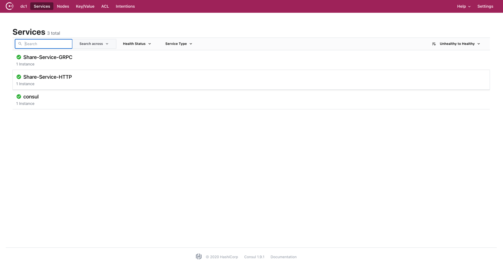
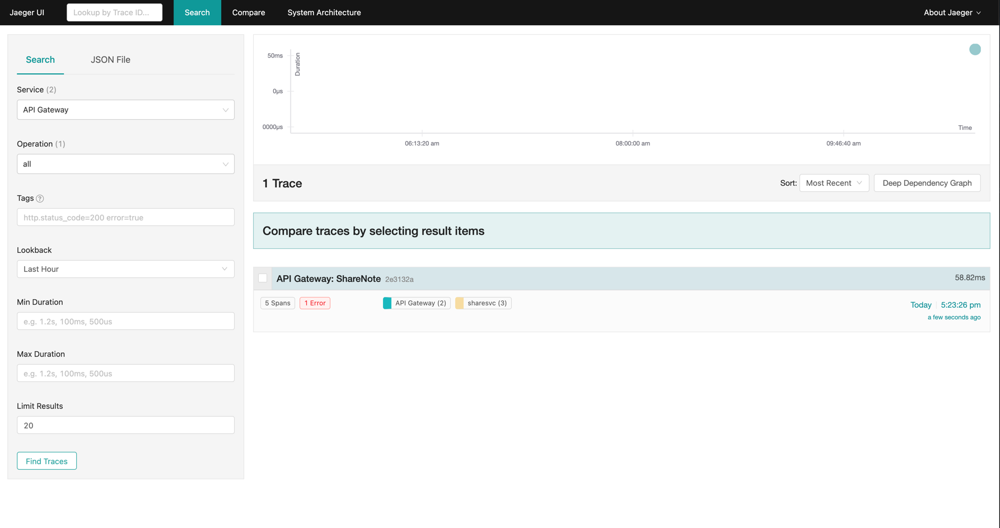
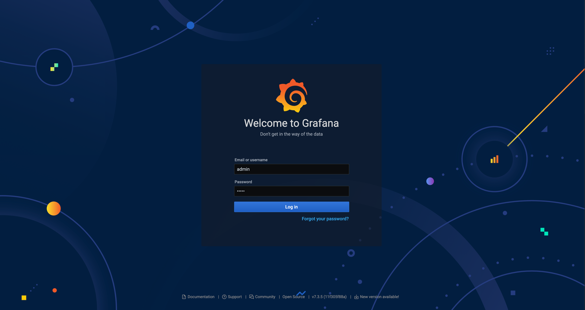
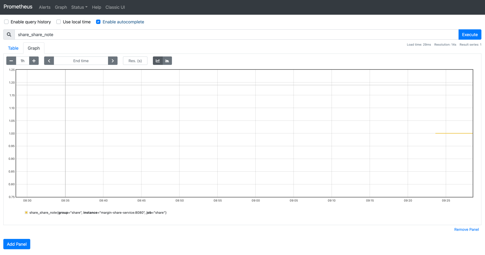

# shareable-notes
A temporary solution for note sharing across multiple platforms.

This repo is a go-kit microservices project.

micro-architecture:

client requests -> API gateway -> Share note service

## Instructions
1. Start
    ```shell
    docker-compose up
    ```
   
2. The Consul dashboard

   Open the browser and enter in http://localhost:8500
    

2. The Jaeger tracing dashboard
    
    Open the browser and enter in http://localhost:16686
    
   
3. The Grafana Monitor dashboard
   
   Open the browser and enter in  http://localhost:9093
   
   
4. The Prometheus Dashboard
   
    Open the browser and enter in  http://localhost:9090
   
   